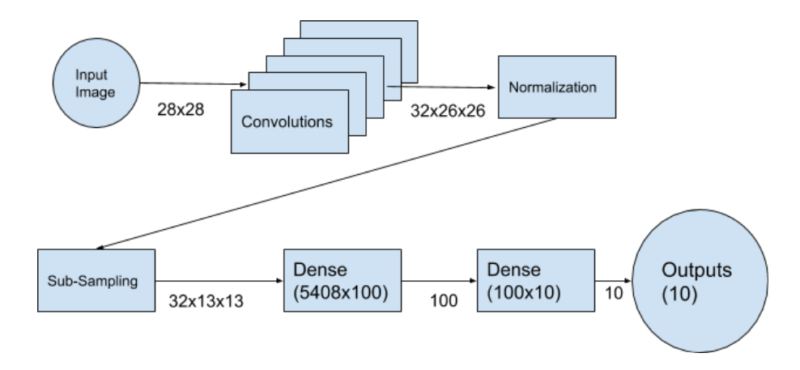

### Overview 
The challenge for this problem is recognizing hand-written digits. This is achieved through the use of the MNIST dataset. What is MNIST? MNIST stands for Modified National Institute of Standards and Technology database. It is a large dataset of labeled images corresponding to different hand-written digits. This is used as both training and testing data for a model that recognizes hand-written numbers. The model will be a Convolutional Neural Network(CNN) which means that it takes a small section of the image and compares them to its filters. Each filter has a different weight and these determine the output.

### My approach
I will be using a CNN. 

Other people used CNNs as well. They also used other operations. One such operation was batch normalization which transforms the input data so that it has mean=0 and std dev=1. Another operation was Dense which allows the model to pick out important features in the training data. It does this by optimizing a matrix of coefficients that will be multiplied by the feature values.

### Diagram of my network

### Performance
We measure performance by looking at the accuracy. For the training data, there was 99.97% accuracy and it had 98.8% accuracy on the testing data. This shows that there was some overfitting that occured which means that the model could have had either fewer parameters or fewer non-zero parameters.

### Next Steps
Optimization:  I will explore hyper parameter optimization. This will minimize the overfitting that occured.

Analyze the convolution filters to see what patterns the model looks for in the image.
